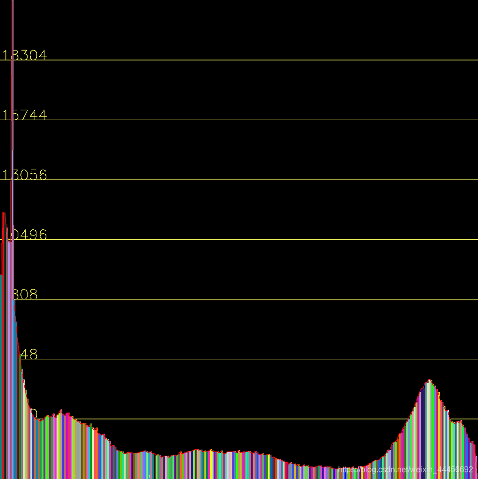
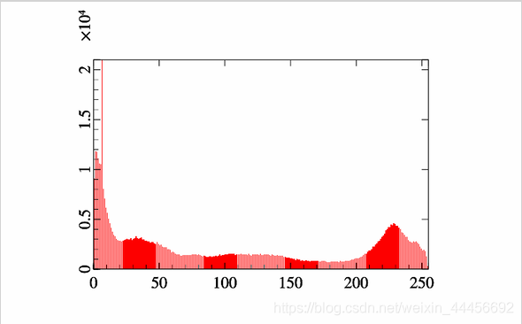
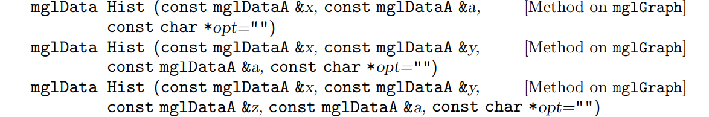
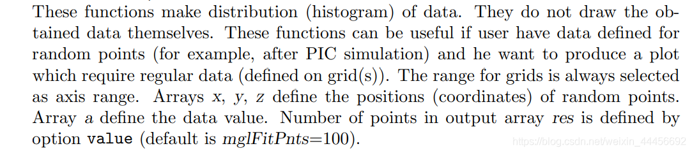
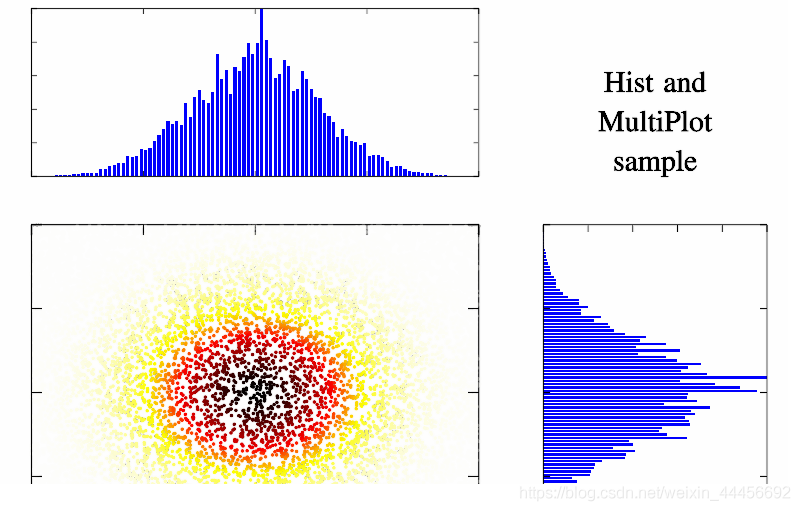

# 环境：
visual studio 2019 + opencv3.3.1 + mathGL
# 问题描述：
C++里边画直方图不是特别方便，虽然也可以结合opencv的hist函数，自己写一个，下面是自己写的一个函数效果：


总的来说，还是较麻烦，C++的可视化库比较少，今天就尝试一下MathGl。


# 配置MathGL：
[安装参考](https://gitee.com/Leowootsi/plotdemo/tree/master/)

另外还可以参考MathGL的官方文档以及教程。
[MathGl官方文档](http://mathgl.sourceforge.net/index.html)
[教程下载](https://www.researchgate.net/publication/280555582_Manual_for_MathGL_version_233/link/55b8dd9608aed621de07c218/download)
# 代码演示：
代码：

```cpp
#include <opencv2/core.hpp>
#include <opencv2/imgproc.hpp>
#include <opencv2/highgui.hpp>

#include <iostream>
#include <algorithm>
#include <vector>

#include "mgl2/mgl.h"
using namespace std;
using namespace cv;
int my_hist(mglGraph* gr, Mat gray)
{

	int histSize = 256;	// 直方图bin的个数
	float range[] = { 0, 256 };	// 输入数据的维度 灰度值范围为0-255
	const float* histRanges = { range };
	Mat hist;
	calcHist(&gray, 1, 0, Mat(), hist, 1, &histSize, &histRanges, true, false);
	
	mglData y;
	mglData* py = &y;
	py->Create(256);

	for (int i = 0; i < hist.rows; i++)
	{
		py->a[i] = hist.at<float>(i);
	}
	
	//y.Norm(mreal(0), mreal(1));
	gr->SetRanges(0, 255, 0, y.Maximal());
	gr->Axis(); // 坐标轴
	gr->Box(); 
	gr->Bars(y);
	return 0;
}
int main(int argc, char** argv) 
{
	Mat src, dst;
	src = imread("pictures/test.jpg", IMREAD_COLOR);//src 缩写为源文件 打开的文件名要加上格式 比如 jpg
	if (src.empty())
	{
		printf("could not load image....\n");
		return -1;//返回值为-1 表示异常
	}
	namedWindow("input", CV_WINDOW_AUTOSIZE);//创建一个窗口并命名
	imshow("input", src);//在指定窗口显示指定图片
	
	cvtColor(src, dst, COLOR_BGR2GRAY);

	Mat hist_img = my_drawHist(dst);
	//创建gr对象，指定图像大小为800x500,kind=0说明不使用OpenGL
	mglGraph gr1(0, 800, 500);
	
	my_hist(&gr1, dst);
	//用OpenCV显示图片
	Mat pic(gr1.GetHeight(), gr1.GetWidth(), CV_8UC3);
	pic.data = const_cast<uchar*>(gr1.GetRGB());
	imshow("test", pic);

	//保存图片
	std::cout << "write image as \"test.png\"." << std::endl;
	gr.WritePNG("test.png");  // Don't forget to save the result!

	waitKey(0);
	return 0;
}
```
结果：

# 后记
mathGL也提供了一个Hist函数：

但是，如果只是画图像的直方图的话用不到这个函数，在官方文档里边提到：

也就是说，这个函数只有在用户自己定义了随机的数据（比如x为随机数，y为x的函数），这时候可以使用Hist函数，该函数可以自动帮你统计。
官方demo:

```cpp
void smgl_hist(mglGraph *gr)
{
	mglData x(10000), y(10000), z(10000);	gr->Fill(x,"2*rnd-1");	gr->Fill(y,"2*rnd-1");	gr->Fill(z,"exp(-6*(v^2+w^2))",x,y);
	mglData xx=gr->Hist(x,z), yy=gr->Hist(y,z);	xx.Norm(0,1);	yy.Norm(0,1);
	gr->MultiPlot(3,3,3,2,2,"");	gr->SetRanges(-1,1,-1,1,0,1);	gr->Box();	gr->Dots(x,y,z,"wyrRk");
	gr->MultiPlot(3,3,0,2,1,"");	gr->SetRanges(-1,1,0,1);	gr->Box();	gr->Bars(xx);
	gr->MultiPlot(3,3,5,1,2,"");	gr->SetRanges(0,1,-1,1);	gr->Box();	gr->Barh(yy);
	gr->SubPlot(3,3,2);		gr->Puts(mglPoint(0.5,0.5),"Hist and\nMultiPlot\nsample","a",-3);
}

```
结果：
