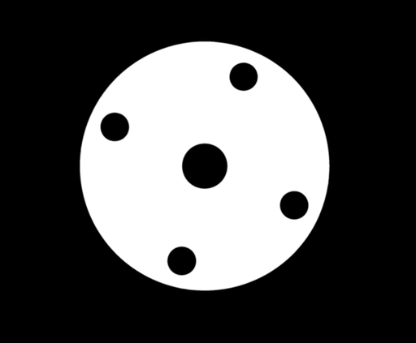

### 一种寻找铸铁发动机零件轮廓和表面缺陷的低成本视觉系统的开发

原文地址：http://www.diva-portal.org/smash/get/diva2:730786/FULLTEXT01.pdf

#### 文章脉络

```c++
一. 背景
    1. 生产线情况，包括零件加工顺序，零件中可能存在的缺陷
    2. 零件上的污染干扰，包括切削液痕迹和金属碎屑，以及解决方法
    3. 零件的缺陷类型，包括表面缺陷和轮廓缺陷，两者检测的方法不同，表面缺陷更容易检测
    4. 零件的形状误差，和轮廓缺陷不同，可能由夹具误差造成，比如孔中心位置偏移
    5. 其他要求 技术指标，哪些表面是关键表面，算法的灵活性，速度等
二. 硬件
    1. 相机 ->
        a. 扫描相机 用于传送带速度高、零件非常长的情景
        b. 结构光相机 能够测出深度，但价格高
        c. 常规阵列传感器相机 优点是价格低，缺点是得调焦距，图像有畸变和模糊，不能获取深度。
        d. 相机的选取、触发 红外遥控、有线遥控、WIFI控制 比如激光触发
    2. 镜头 ->
        焦距越短，视角越大，这样系统比较紧凑，但是会出现严重的失真（比如鱼眼相机） ，而且背景区域很难去掉
    3. 灯光设置 -> 重点：关键区域高对比、其余区域低对比、系统鲁棒性强
		a. 光源：聚光灯、阵列灯、环形灯、相机闪光灯单一或组合 对于环形灯，如果光源比较刺眼，可以安装漫射器进行软化。
		b. 环境光： 不同时间段环境光不同，LED等光是可调或自调的 必要时可使用黑箱。也要考虑产线上其他部位的反射 遮盖胶带简直是个神器。
    4. 相机支架 考虑到相机、镜头、光源的总重量，选取支架的自由度 考虑到传送带的振动，选取恰当的安装位置
    5. PC 主要考虑PC的性能，远程控制相机的软件
    6. 毛刷系统 除去污染物
    7. 系统成本 成本主要在于开发软件，前期MATLAB实现算法，后期使用OpenCV + C++完成。
三. 算法 -> 分为四步
    1. 图像分割、去除噪声 ->
    	a. 边缘检测 canny算法：滤波降噪>>计算梯度，找到边缘点>>对边缘像素进行非最大阈值处理，找到强边缘点和弱边缘点>>使用8连通将弱边点连接到强边点。 或者直接二值化找轮廓，快！
    	b. 形态学操作 膨胀后轮廓线变宽，能填充一些缝隙，但是细节会丢失
    	c. 去除噪声 上述两步使非连续的轮廓连续且封闭，接下来通过轮廓分析（长度，面积），找到零件轮廓，
    	d. Masking 填充上一步找到的轮廓，然后进行开操作，去除白色噪声，得到二值掩膜。然后将膨胀操作后的轮廓与该二值掩膜相乘（bit_and），得到零件轮廓。
    
    2. 轮廓检测 ->
    	a. 主要轮廓是否存在 根据周长进行筛选出主轮廓，看11个主轮廓是否都存在。-> 存在一些问题
    		1). 一些大的缺陷和钻孔轮廓连接在一起，造成提取轮廓失败失败
    		2). 可以通过中心特征法将钻孔和大的缺陷区分开来
    	b. 若轮廓存在，轮廓上是否有缺陷 ->
    		1). 中心特征法 找到零件轮廓，与理想轮廓线进行比较，找打缺陷位置（极坐标）。
    		2). 有一个替代方法 不使用中心点，计算每个轮廓点的切线和参考线之间的角度，角度越大，说明此处的轮廓误差越大。
    
    3. 表面缺陷检测
    	a. 检测缺陷尺寸 -> 有两个思路
    		A). 将缺陷与标准件进行比较
    		B). 估计缺陷的像素面积，或者估计缺陷的像素长度
    
    4. 结果显示 -> 根据检测标准，确定缺陷是否合格，并将缺陷类型和尺寸一起输出。
    		1). 还有两种运行模式 第一种是不管缺陷的尺寸和严重程度，显示所有的轮廓和缺陷，这种模式可以快速判断轮廓检测阶段是否正常
    		2). 第二种是不与标准件进行比较，将所有缺陷显示出来，判断零件是否有缺陷进行质量分析。
    		3). 软件自动保存缺陷检测结果，建立数据库，方便后续改进和开发
四. 系统校准以及与人工检测的对比
    1. 系统校准
    	一周内进行了150次测试，对算法进行改进和校准，与质检人员进行沟通
    2. 盲法实验
        结果发现，相比于人工检测，视觉系统过于敏感，即回收率高，但正确率低。
    	而且，视觉系统发现的轮廓缺陷多，表面缺陷少
    结论：该算法在不同的检测条件下都有较好的检测效果，可以发现大量的缺陷，且检测精度令人满意。盲法检实验表明，该系统可以与人工检测进行比较。然而，由于缺乏深度信息，使用单张图像的系统在理论上永远不会超过人工检查。
    
    
    
```

* 相机的选取

工业上相机的帧率不用太高。具体选择的时候，要考虑分辨率，根据零件中最小的缺陷的尺寸选择。还有其他需要考虑的东西，比如数据传输，耐震性能，环境密封性。

广角镜头是一种焦距短于标准镜头、[视角](https://baike.baidu.com/item/视角/1192660)大于标准镜头、焦距长于鱼眼镜头、视角小于[鱼眼](https://baike.baidu.com/item/鱼眼/3504437)镜头的[摄影](https://baike.baidu.com/item/摄影/6201)镜头。广角镜头又分为普通广角镜头和超广角镜头两种。

普通广角镜头的焦距一般为38－24毫米，视角为60－84度；超广角镜头的焦距为20－13毫米，视角为94-118度。

* 灯光设置

由于不同的光源、滤镜使用受限，且==一般不遮挡环境光==（受限于成本、空间、简 化），只能对不同设备进行有限的调查和测试。 论文中最后采取了垂直光源。

* 关于算法

有些算法是MATLAB自带的，有些是自己定义的。

算法分为四步：

```c++
1. 图像分割、掩膜、滤波 
2. 轮廓验证和发现轮廓缺陷 
3. 发现表面缺陷 
4. 结果分析展示
```

 上述四步循环运行，处理图像，显示和保存结果，然后等待下一个图像。所有的主要零件都被进一步划 分为几个面，如果没有发现缺陷，可以在中间跳过每个面。也可能出现算法的第一部分失败的情况，在 这种情况下，它会显示一个可能的原因的错误消息，保存结果并等待下一个图像。

canny算法：

参考：https://zh.wikipedia.org/wiki/Canny%E7%AE%97%E5%AD%90

滤波降噪>>计算梯度，找到边缘点>>对边缘像素进行非最大阈值处理，找到强边缘点和弱边缘点>>使用8连通将弱边点连接到强边点。

需要采取措施可靠地检测出钻孔的轮廓，并将 其与大缺陷区分开来。

#### 针对法兰盘项目，代码复现：

```c++
//#include <opencv2/opencv.hpp>
#include <opencv2/core.hpp>
#include <opencv2/imgproc.hpp>
#include <opencv2/highgui.hpp>
#include <iostream>
#include <stdio.h>
#include <string>
#include <cmath>

using namespace cv;
using namespace std;


float ratio = 0.049113; // 1个像素代表几个毫米

double getDistance(Point point1, Point point2)
{
	double distance;
	distance = powf((point1.x - point2.x), 2) + powf((point1.y - point2.y), 2);
	distance = sqrtf(distance);
	return distance;
}

/** @brief 中心特征法.
将迪卡儿坐标系中的一堆轮廓转换到极坐标中，将二维曲线转化为一维曲线，横坐标为角度θ，纵坐标为r.
@param cnts 轮廓，以vector<vector<Point>>形式表示
@param index 轮廓的索引值
@param cnt_img 返回cnt画出来的轮廓图
@parma output 返回轮廓的极坐标表示
 */
void centroidalProfile(vector<vector<Point>> cnts, int index, Mat&cnt_img, Mat& output)
{

	Mat polar_img;
	drawContours(cnt_img, cnts, index, Scalar(255, 255, 255), 1, LINE_4, Mat(), 0, Point(0, 0));
	Moments mm2 = moments(cnts[index]);
	double cx2 = mm2.m10 / mm2.m00;
	double cy2 = mm2.m01 / mm2.m00;
	circle(cnt_img, Point(cx2, cy2), 2, Scalar(0, 0, 255), -1, 8, 0);
	linearPolar(cnt_img, polar_img, Point(cx2, cy2), 900, INTER_LINEAR + WARP_FILL_OUTLIERS);
	transpose(polar_img, polar_img);
	int h = polar_img.rows;
	int w = polar_img.cols;
	output = Mat::zeros(h, w, polar_img.type());
	for (int i = 0; i < polar_img.rows; i++)
	{
		for (int j = 0; j < polar_img.cols; j++)
		{
			output.at<Vec3b>(i, j) = polar_img.at<Vec3b>(h - i - 1, j);
		}
	}
	putText(output, format("theta"), Point(w - 700, h - 50), FONT_HERSHEY_SIMPLEX, 4, Scalar(0, 255, 255), 2);
	putText(output, format("r"), Point(50, 200), FONT_HERSHEY_SIMPLEX, 4, Scalar(0, 255, 255), 2);
}

int main(int argc, char** argv)
{
	// 读取数据
	Mat src = imread("pictures/test6.jpg");

	if (src.empty())
	{
		cout << "could not open image..." << endl;
		return -1;
	}
	system("color 0A");	// 控制台黑底绿字
	cout << "图像的通道数为：" << src.channels() << endl;

	// 转灰度
	Mat gray;
	cvtColor(src, gray, COLOR_BGR2GRAY);

	// 直方图均衡化
	Mat equa_hist;
	equalizeHist(gray, equa_hist);
	// 模糊
	Mat gaussblur_img;
	GaussianBlur(equa_hist, gaussblur_img, Size(3, 3), 1);
	// 边缘提取
	Mat edge_img;
	Canny(gaussblur_img, edge_img, 130, 200, 3, false);

	//// 膨胀
	//Mat dilate_img;
	//Mat kernel = getStructuringElement(MORPH_ELLIPSE, Size(3, 3));
	//dilate(edge_img, dilate_img, kernel, Point(-1, -1), 1);

	// 轮廓分析
	vector<vector<Point>> contours, dst_contours;
	vector<Vec4i> hierachy, dst_hierachy;
	double max_area = 0;
	int max_area_index = 0;
	int count = 0;
	findContours(edge_img, contours, hierachy, RETR_TREE, CHAIN_APPROX_SIMPLE, Point(0, 0));
	for (int i = 0; i < contours.size(); i++)
	{
		double contour_area = contourArea(contours[i]);
		double contour_length = arcLength(contours[i], false);
		drawContours(src, contours, i, Scalar(0, 0, 255), 4, LINE_8, dst_hierachy, 0, Point(0, 0));
		if (contour_area > 15000 && contour_length > 500)
		{
			dst_contours.push_back(contours[i]);
			dst_hierachy.push_back(hierachy[i]);
			if (contour_area > max_area)
			{
				max_area = contour_area;
				max_area_index = i;
				count++;
			}
		}
	}
	// 绘制
	Mat dst_4 = Mat::zeros(src.size(), CV_8UC3);
	Mat dst_1 = Mat::zeros(src.size(), CV_8UC3);
	Mat dst_2 = Mat::zeros(src.size(), CV_8UC3);
	Mat dst_3 = Mat::zeros(src.size(), CV_8UC3);
	drawContours(dst_4, contours, max_area_index, Scalar(255, 255, 255), -1, LINE_4, dst_hierachy, 0, Point(0, 0));
	
	// 中心特征法分析轮廓
	
	Mat polar_img;
	centroidalProfile(contours, max_area_index, dst_3, polar_img);

	for (int i = 0; i < dst_contours.size(); i++)
	{
		Scalar color1 = Scalar(0, 255, 0);
		Scalar color2 = Scalar(255, 255, 255);

		if (i % 2 == 0)
		{
			drawContours(dst_1, dst_contours, i, color1, 4, LINE_8, dst_hierachy, 0, Point(0, 0));
			if ((i != count) && (i != (count - 1)))
			{
				drawContours(dst_2, dst_contours, i, color2, -1, LINE_8, dst_hierachy, 0, Point(0, 0));
			}
		}

	}
	// make mask
	Mat mask1, mask2, img;
	cvtColor(dst_2, mask1, COLOR_BGR2GRAY);
	cvtColor(dst_4, mask2, COLOR_BGR2GRAY);

	bitwise_not(mask1, mask1);
	bitwise_and(mask1, mask2, mask2);

	bitwise_and(edge_img, mask2, img);

	// surface detect
	vector<vector<Point>> cnts;
	vector<Vec4i> hier;
	findContours(img, cnts, hier, RETR_TREE, CHAIN_APPROX_SIMPLE, Point(0, 0));

	// ansys
	Mat result_show;
	src.copyTo(result_show);
	double cnt_area = 0;
	double cnt_length = 0;

	for (int i = 0; i < cnts.size(); i++)
	{
		cnt_area = contourArea(cnts[i]);
		drawContours(result_show, cnts, i, Scalar(255, 0, 0), 1); // 检测出来的所有轮廓 蓝色显示
		if (cnt_area > 0 && cnt_area < 100)
		{
			if (cnts[i].size() < 5) continue;


			drawContours(result_show, cnts, i, Scalar(0, 255, 0), 1); // 检测出来的疑似缺陷的轮廓 绿色显示
			RotatedRect rrt2 = fitEllipseDirect(cnts[i]);
			double radius2 = min(rrt2.size.width, rrt2.size.height) / 2.0;
			float k = rrt2.size.width / rrt2.size.height;
			bool iswant = k > 0.8 && k < 1.2;

			if (iswant)
			{
				circle(result_show, rrt2.center, radius2 + 10, Scalar(0, 0, 255), 4, 8, 0);	// 确定是缺陷的轮廓，红色圈起来
				Moments mm2 = moments(cnts[i]);
				double cx2 = mm2.m10 / mm2.m00;
				double cy2 = mm2.m01 / mm2.m00;
				//circle(result_show, Point(cx2, cy2), 1, Scalar(255, 0, 0), 1, 8, 0);
				//putText(result_show, format("%fpix", radius2 * 2), rrt2.center, FONT_HERSHEY_SIMPLEX, 1, Scalar(0, 0, 255), 1, 8);
				putText(result_show, format("%fmm", radius2 * 2 * ratio), rrt2.center, FONT_HERSHEY_SIMPLEX, 1, Scalar(0, 0, 255), 1, 8);

			}
		}

	}
	waitKey(0);
	return 0;
}
```

代码中实现了图像分割、中心特征法分析轮廓、表面缺陷分析、结果展示

#### 效果展示：

|      图像分割      |  |   canny边缘提取、轮廓分析找到几个主轮廓、制作掩膜    |
| :----------------: | :----------------------------------------------------------: | :--------------------------------------------------: |
| 中心特征法分析轮廓 |  |          图中是对法兰盘的外圆轮廓进行了分析          |
|    表面缺陷分析    |                                                              | 轮廓分析，没啥特别的，主要是通过分析轮廓的面积、长度 |
|      结果展示      |  |                                                      |